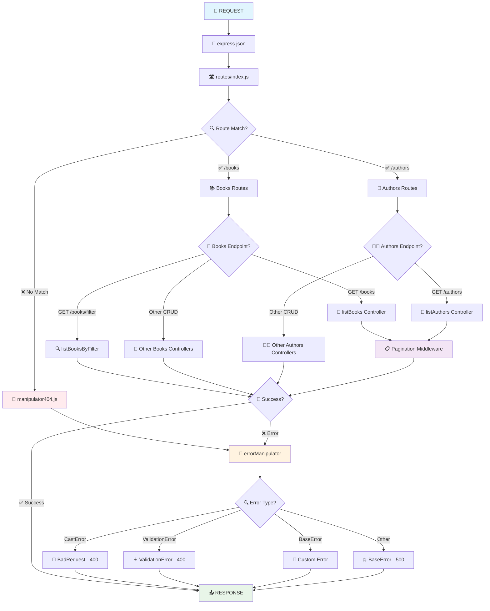

# 🗺️ Diagrama dos Middlewares - API Node.js



## 📋 Fluxo dos Middlewares

### 1. **Middlewares Globais (app.js)**
```javascript
app.use(express.json());        // Parse JSON do body
routes(app);                    // Aplica todas as rotas
app.use(manipulator404);        // Captura rotas inexistentes
app.use(errorManipulator);      // Trata todos os erros
```

### 2. **Route Middlewares**
- `books`: `/books`, `/books/:id`, `/books/filter`
- `authors`: `/authors`, `/authors/:id`

### 3. **NEW! Pagination Middleware (page.js)**
- Aplicado em: `GET /books` e `GET /authors`
- Funcionalidades:
  - **Paginação:** `?limit=5&pages=2`
  - **Ordenação:** `?sortBy=title:1` ou `?sortBy=pagesNumber:-1`
  - **Populate:** Carrega dados do autor automaticamente

### 4. **Controller Layer**
- `booksController`: CRUD + filtros avançados + paginação
- `authorsController`: CRUD básico + paginação
- **Filtros avançados:** publisher, title, authorName, minPages, maxPages

### 5. **Error Handling Chain**
```
manipulator404 → errorManipulator → Response
```
- **CastError:** ObjectId inválido → 400
- **ValidationError:** Dados inválidos → 400
- **BaseError:** Erros customizados → 404, etc
- **Other:** Erro genérico → 500

### 6. **Response Types**
- **200** - Success (GET com resultados)
- **201** - Created (POST successful)
- **400** - Bad Request/Validation
- **404** - Not Found
- **500** - Internal Error

## 🔥 Características

- ✅ **Centralizado** - Um middleware para todos os erros
- ✅ **Tipado** - Diferentes tipos de erro  
- ✅ **Fallback** - 404 para rotas inexistentes
- ✅ **Consistente** - Mesmo formato de resposta
- 🆕 **Paginação** - Middleware reutilizável para listagens
- 🆕 **Ordenação** - Sort dinâmico por qualquer campo
- 🆕 **Filtros Avançados** - Busca por múltiplos critérios
- 🆕 **Populate Automático** - Carrega relacionamentos automaticamente

## 🚀 Como usar o GitHub para mostrar o diagrama:

### **Opção 1 - GitHub nativo (RECOMENDADO):**
- GitHub já renderiza Mermaid automaticamente!
- Só commitar este arquivo `.md` e o diagrama aparece bonitinho

### **Opção 2 - Mermaid Live + Badge:**
```markdown
[](https://mermaid.live/)
```

### **Opção 3 - GitHub Pages:**
- Ativar GitHub Pages no repositório
- O markdown renderiza com o diagrama