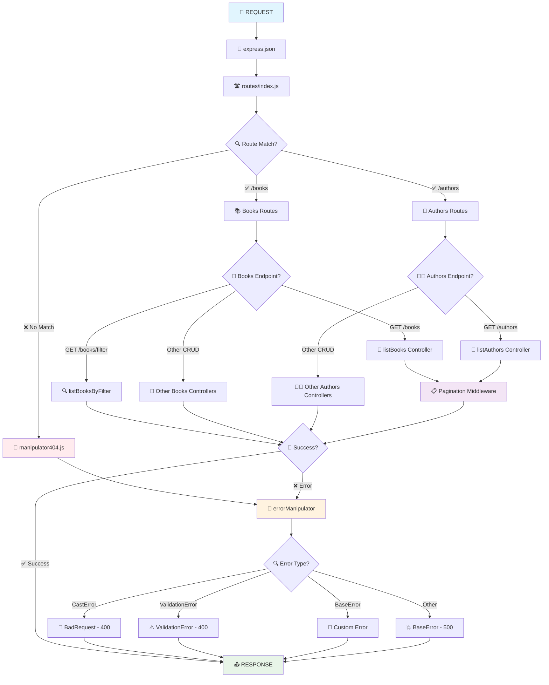

# 📚 Books & Authors API

Uma API RESTful moderna para gerenciamento de uma livraria fictica, construída com Node.js, Express e MongoDB.

## 🚀 Tecnologias

- **Node.js** - Runtime JavaScript.
- **Express** - Framework web.
- **MongoDB** - Banco de dados NoSQL.
- **Mongoose** - ODM para MongoDB.

## ⚙️ Arquitetura dos Middlewares



## 🎲 Funcionalidades

- ✅ **CRUD completo** para autores e livros
- ✅ **Relacionamento** entre livros e autores (populate)
- ✅ **Validações customizadas** com mensagens em português
- ✅ **Tratamento de erros** com classes especializadas
- ✅ **Middleware de erro** centralizado
- ✅ **Filtros avançados** para busca de livros
- ✅ **Query parameters** flexíveis (editora, autor, páginas, título)
- ✅ **Códigos HTTP apropriados** (200, 400, 404, 500)
- 🆕 **Utilização do Swagger** para documentação apropriada

## 🔧 Instalação

1. **Clone o repositório:**
```bash
git clone https://github.com/flavio-kolenez/api-node-js.git
cd api-node-js
```

2. **Instale as dependências:**
```bash
npm install
```

3. **Configure o MongoDB:**
   - Este projeto utiliza **MongoDB Atlas** (cloud database)
   - Configure sua string de conexão no arquivo `src/config/dbConnect.js`

4. **Execute o projeto:**
```bash
npm run dev
```

A API estará disponível em: `http://localhost:3000`

## 🖥️ Usando o Swagger UI localmente

Após clonar e instalar as dependências, você pode acessar a documentação interativa da API via Swagger UI:

1. Primeiro certifique-se de que o projeto está rodando:
   ```bash
   npm run dev
   ```

2. Abra o navegador e acesse:
   ```
   http://localhost:3000/api-docs
   ```

Você verá a interface Swagger UI, onde pode explorar todos os endpoints, parâmetros, modelos e testar requisições diretamente pelo navegador.

## ⚙️ Configuração do MongoDB Atlas

1. **Crie uma conta no MongoDB Atlas:** https://www.mongodb.com/atlas
2. **Crie um cluster gratuito**
3. **Configure o acesso:**
   - Adicione seu IP na whitelist
   - Crie um usuário de banco de dados
4. **Obtenha a string de conexão:**
   ```
   mongodb+srv://<username>:<password>@cluster0.xxxxx.mongodb.net/<dbname>
   ```
5. **Configure no arquivo `src/config/dbConnect.js`**

6. **⚠️ Segurança - Configure variáveis de ambiente:**
   ```bash
   # Crie um arquivo .env na raiz do projeto
   MONGODB_URI=mongodb+srv://<username>:<password>@cluster0.xxxxx.mongodb.net/<dbname>
   PORT=3000
   ```
   
   **Importante:** Adicione `.env` no `.gitignore` para não subir credenciais!

7. **Para usar as variáveis de ambiente, instale dotenv:**
   ```bash
   npm install dotenv
   ```
   
   **No arquivo `src/config/dbConnect.js`:**
   ```javascript
   import 'dotenv/config';
   
   const connectionString = process.env.MONGODB_URI;
   ```

## 📖 Documentação de rotas da API

### **Endpoints para autores**

| Método | Endpoint | Descrição |
|--------|----------|-----------|
| GET | `/authors` | Lista todos os autores |
| GET | `/authors/:id` | Busca autor por ID |
| POST | `/authors` | Cria novo autor |
| PUT | `/authors/:id` | Atualiza autor |
| DELETE | `/authors/:id` | Remove autor |

### **Endpoints para livros**

| Método | Endpoint | Descrição |
|--------|----------|-----------|
| GET | `/books` | Lista todos os livros |
| GET | `/books/:id` | Busca livro por ID |
| GET | `/books/find?publisher=nome` | Busca livros por editora |
| POST | `/books` | Cria novo livro |
| PUT | `/books/:id` | Atualiza livro |
| DELETE | `/books/:id` | Remove livro |

## 📁 Estrutura do Projeto

```
src/
├── config/
│   └── dbConnect.js          # Configuração do MongoDB
├── controllers/
│   ├── authorsController.js  # Lógica dos autores
│   └── booksController.js    # Lógica dos livros
├── errors/
│   ├── BaseErrors.js         # Classe base de erros
│   ├── BadRequestError.js    # Erro 400
│   ├── NotFound.js           # Erro 404
│   └── validationError.js    # Erros de validação
├── middlewares/
│   ├── middlewares.js        # Middleware de tratamento de erros
│   └── manipulator404.js     # Middleware para rotas não encontradas
├── models/
│   ├── Author.js             # Schema do autor
│   └── Book.js               # Schema do livro
├── routes/
│   ├── authorRoutes.js       # Rotas dos autores
│   ├── booksRoutes.js        # Rotas dos livros
│   └── index.js              # Agregador de rotas
└── app.js                    # Configuração do Express
```

## ⚠️ Tratamento de Erros

A API retorna erros padronizados:

- **400** - Dados inválidos ou ID malformado
- **404** - Recurso não encontrado
- **500** - Erro interno do servidor


## 👨‍💻 Autor

**Flavio Kolenez**
- GitHub: [@flavio-kolenez](https://github.com/flavio-kolenez)

---

⭐ **Se este projeto foi útil para você, deixe uma estrela!**